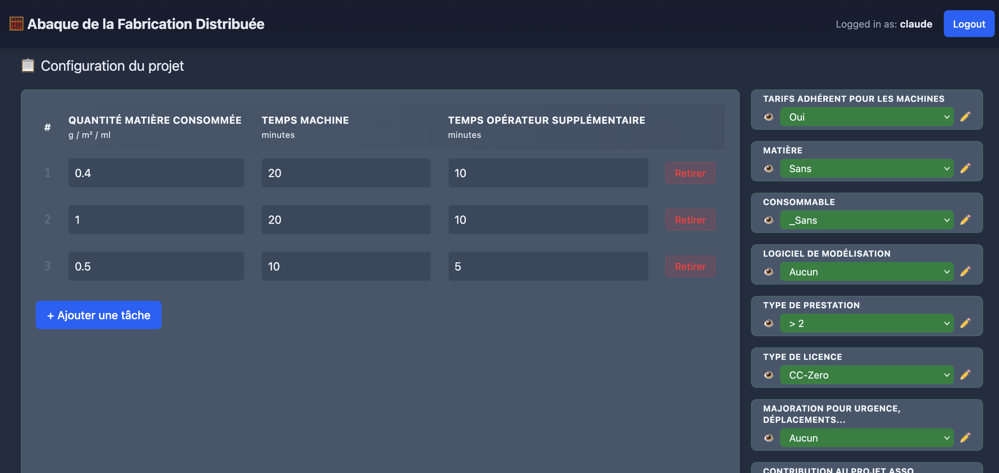
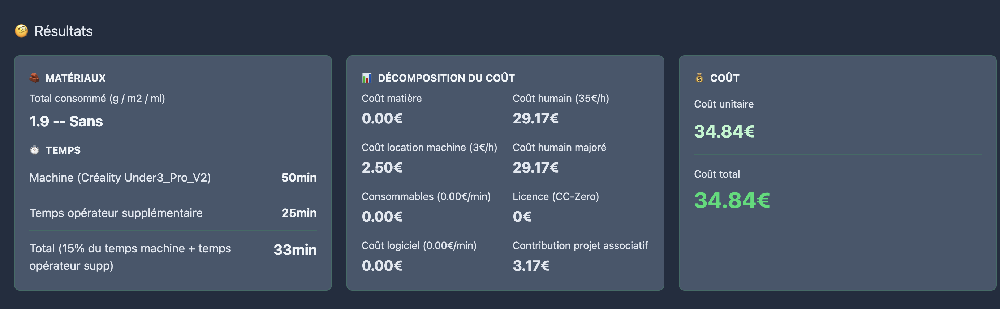

# 🧮 Abaque de la Fabrication Distribuée

Calculateur de coûts de fabrication pour fablab / atelier partagé. L'application permet d'estimer le prix d'une prestation (impression 3D, découpe laser, CNC, découpe vinyle…) en combinant le coût matière, la location machine, les consommables, le logiciel, le temps humain, la licence et la contribution au projet associatif.



Chaque utilisateur peut personnaliser les tarifs (machines, matières, consommables…) et sauvegarder ses projets pour les recharger plus tard.

## Fonctionnalités

- **Calcul de coût en temps réel** : le récapitulatif (matériaux, temps, décomposition du coût, coût final) se met à jour à chaque changement de sélection ou de quantité.
- **Tâches multiples** : ajout de lignes (quantité de matière, temps machine, temps opérateur supplémentaire) qui s'additionnent dans le calcul.
- **Neuf groupes de choix configurables** : tarif adhérent, matière, consommable, logiciel de modélisation, type de prestation, type de licence, majoration (urgence, soirée…), contribution au projet associatif, machine.
- **Options personnalisables par utilisateur** : chaque groupe est éditable via une fenêtre modale (✏️) — ajout/suppression d'options et de propriétés, sauvegardées en base par utilisateur sans toucher aux valeurs par défaut.
- **Projets sauvegardés** : enregistrement de l'état complet du calculateur sous un nom, rechargement et suppression en un clic (HTMX).
- **Multi-utilisateurs** : chaque utilisateur ne voit que ses propres configurations et projets. Interface d'administration Django incluse.

## Stack technique

| Composant | Choix |
|-----------|-------|
| Backend | [Django](https://www.djangoproject.com/) ≥ 5.2 (vues fonctions, sans DRF) |
| Interactivité | [HTMX](https://htmx.org/) 2 (CDN) + JavaScript vanilla |
| CSS | [Tailwind CSS](https://tailwindcss.com/) v4 (compilé via `@tailwindcss/cli`) |
| Base de données | SQLite (dev) — remplaçable via `DATABASES` dans les settings |

## Démarrage rapide

### Prérequis

- Python 3.10 ou plus (requis par Django 5.2)
- Node.js (uniquement pour recompiler le CSS)

### Installation

```bash
# 1. Environnement virtuel + dépendances Python
python -m venv .venv
source .venv/bin/activate
pip install -r requirements.txt

# 2. Base de données
python manage.py migrate

# 3. Créer un premier utilisateur (l'inscription publique est désactivée)
python manage.py createsuperuser

# 4. Lancer le serveur
python manage.py runserver
```

Ouvrir <http://127.0.0.1:8000/> et se connecter. Les utilisateurs supplémentaires se créent via l'admin Django (<http://127.0.0.1:8000/admin/>).

### Recompiler le CSS (si vous modifiez les templates ou le JS)

```bash
npm install
npm run build:css
```

La feuille compilée est versionnée dans `static/css/output.css` ; la recompilation n'est nécessaire que si vous ajoutez des classes Tailwind.

## Configuration

Les réglages sensibles se font par variables d'environnement (valeurs de développement par défaut) :

| Variable | Défaut | Rôle |
|----------|--------|------|
| `SECRET_KEY` | `dev-secret-key` | Clé secrète Django — **obligatoire en production** |
| `DEBUG` | `true` | Mode debug (`true`/`false`) |
| `ALLOWED_HOSTS` | `*` si `DEBUG`, vide sinon | Hôtes autorisés, séparés par des virgules |

En production (`DEBUG=false`), les cookies sécurisés et la redirection HTTPS (`SECURE_SSL_REDIRECT`) sont activés automatiquement.

## Structure du projet

```
├── project/                 # Configuration Django (settings, urls, wsgi)
├── abaque/                  # Application principale
│   ├── views.py             # Vues + DEFAULT_GROUPS (tarifs par défaut)
│   ├── models.py            # UserConfiguration, UserSavedJob
│   ├── urls.py              # Routes de l'app et de l'API
│   ├── static/js/
│   │   ├── app.js           # Calculs du récapitulatif, état du calculateur
│   │   ├── modal.js         # Éditeur d'options + appels API
│   │   └── table.js         # Tableau des tâches (lignes qty/temps)
│   ├── templates/abaque/    # Page principale, section de configuration, liste des projets
│   └── tests.py             # Suite de tests (authentification, API, projets)
├── templates/               # Gabarits d'authentification (login)
├── static/css/              # tailwind.css (source) → output.css (compilé)
└── requirements.txt
```

### Modèle de données

- **`DEFAULT_GROUPS`** (`abaque/views.py`) : les neuf groupes d'options et leurs tarifs par défaut, définis côté serveur. Les identifiants de groupe (1 à 9) sont stables et référencés par le JavaScript.
- **`UserConfiguration`** : surcharge des options d'un groupe pour un utilisateur (JSON). En son absence, les valeurs par défaut s'appliquent.
- **`UserSavedJob`** : instantané complet du calculateur (sélections, lignes de tâches, nombre d'exemplaires) sauvegardé sous un nom.

### API (authentification requise, format JSON)

| Méthode | URL | Rôle |
|---------|-----|------|
| `GET` / `POST` | `/api/configurations/` | Lire / enregistrer les options personnalisées (payload validé : liste d'objets avec `name`, 200 options max par groupe) |
| `GET` / `POST` | `/api/saved-jobs/` | Lister (fragment HTML pour HTMX) / créer un projet sauvegardé |
| `POST` | `/api/saved-jobs/<id>/apply/` | Récupérer l'état d'un projet pour le recharger |
| `DELETE` | `/api/saved-jobs/<id>/delete/` | Supprimer un projet |

## Tests

```bash
python manage.py test
```

La suite couvre les redirections d'authentification, la validation des payloads de configuration, le cycle complet des projets sauvegardés (y compris la compatibilité avec les anciens états doublement encodés) et l'isolation entre utilisateurs.

## Notes de calcul

- Les prix machine (`prix_normal` / `prix_adherent`) sont exprimés en **€/heure** ; les temps saisis sont en **minutes** (la conversion est faite dans `app.js`).
- Le temps opérateur facturé = temps machine × `pourcent_temps` de la machine + temps opérateur supplémentaire.
- Coût final unitaire = coût brut − coût humain + coût humain × coefficient de majoration + coût brut × pourcentage de contribution.

## Licence

Distribué sous licence [GNU AGPL v3](LICENSE).
